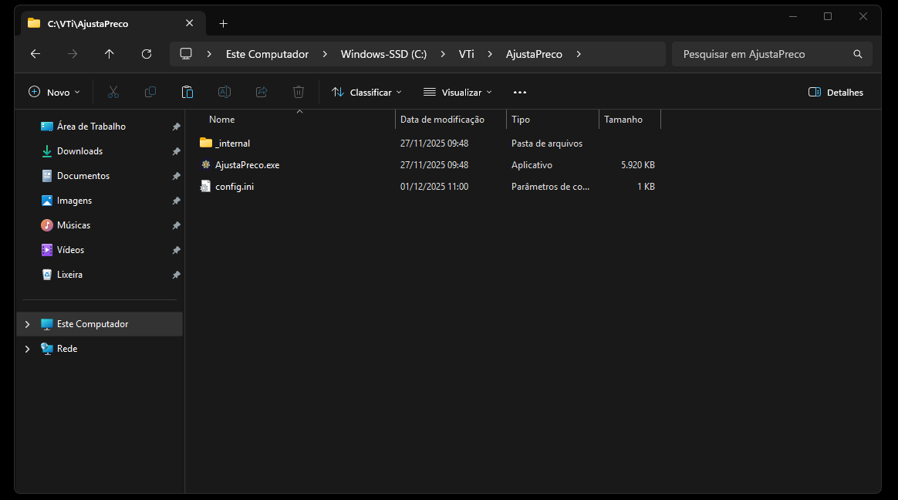
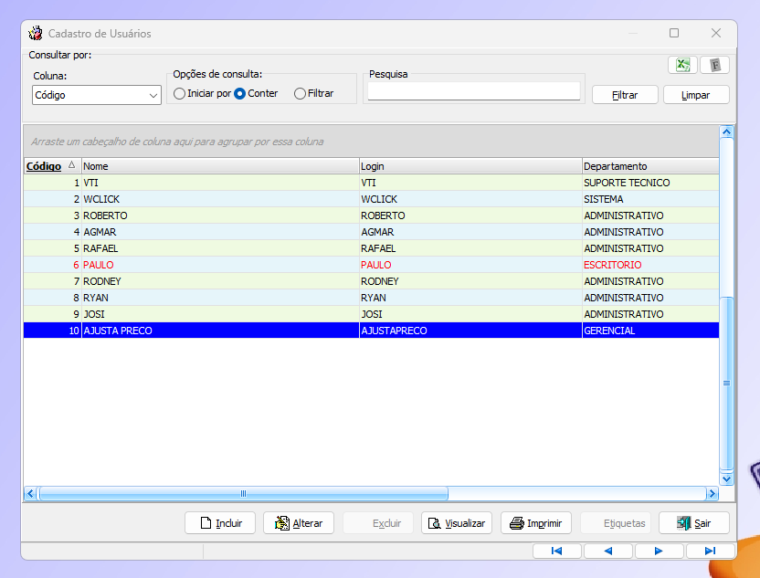
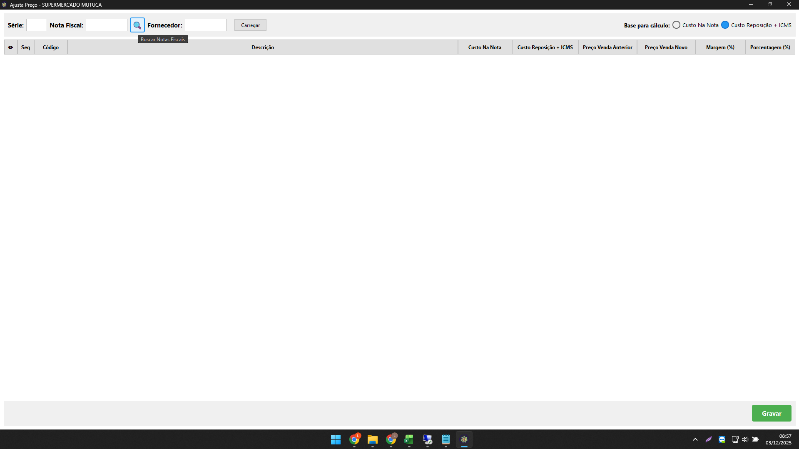
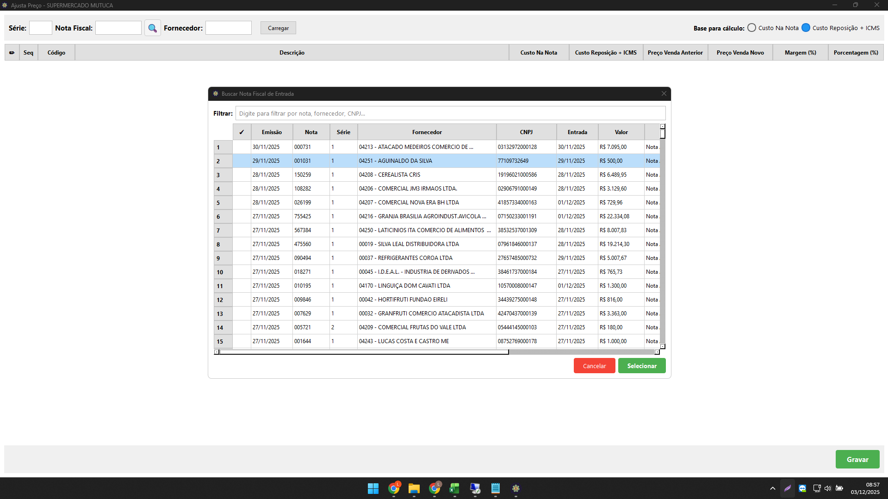
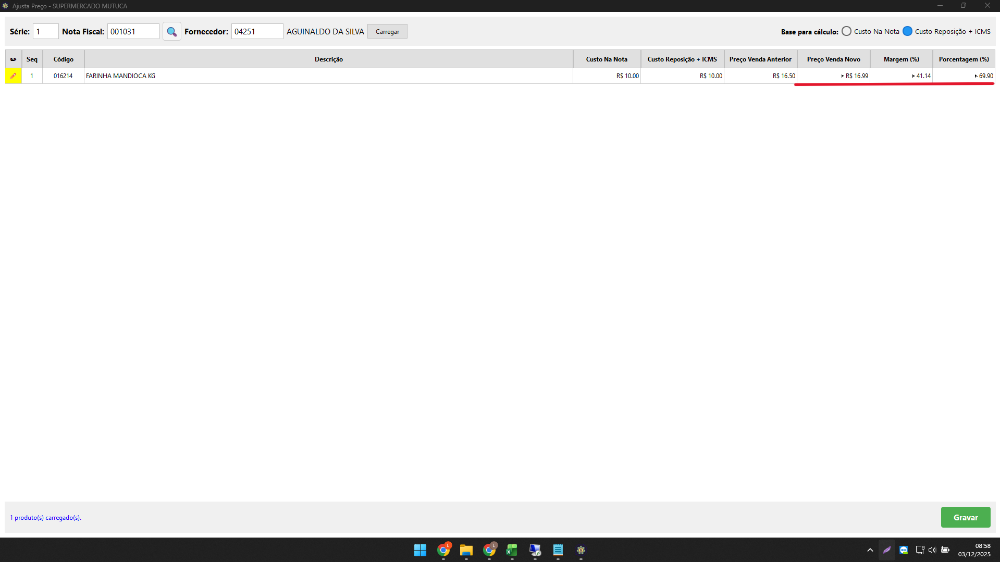
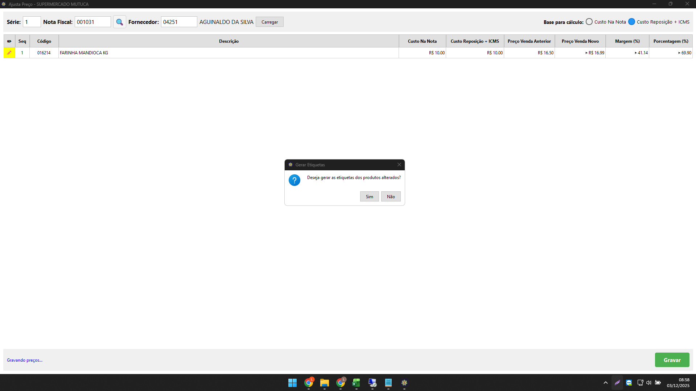
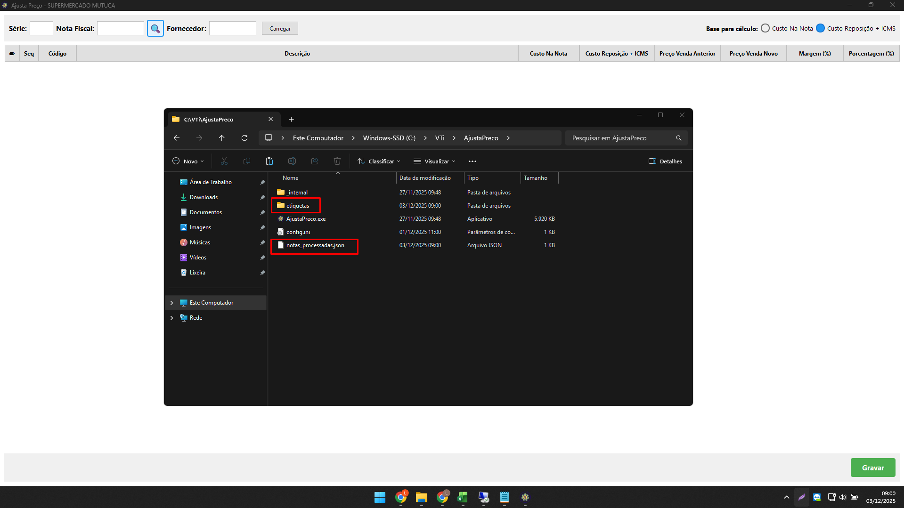

# Ajusta Preço💰

Sistema desenvolvido para precificação das notas de entrada, com foco em supermercados que utilizam o sistema VTi.

#
## Stack utilizada🛠️

**python 3.12.10 🐍**

**pyodbc 4.0.0** - Para conexão com banco de dados

**reportlab 4.0.0** - Para geração das etiquetas em PDF

**python-barcode 0.15.0** - Para geração dos códigos de barras para etiquetas
#
## Download⏬

Faça o Download da ultima versão pelo link abaixo:

 - [Link de Download](https://github.com/luisfd3v/ajusta-preco/releases/download/v0.9.0/AjustaPreco.zip)

Após fazer o Download, crie uma pasta AjustaPreco na pasta raiz do VTi e extraia os arquivos da pasta zip.

#
Abra o arquivo config.ini na pasta AjustaPreco e configure de acordo com os dados de acesso do banco de dados, exemplo:

server = localhost - (ou ip do servidor)

database = F002

username = sa

password = abc123*

driver = {SQL Server} - ⚠️(não alterar)⚠️

usuario_evolucao = 2

fullscreen = 1

(No arquivo config.ini virá um exemplo pré configurado.)
#
**‼️Importante‼️**

- Arquivo config.ini deve estar sempre na mesma pasta que o executável.

- Criar um usuário no Núcleo do VTi para usar o id no campo usuario_evolucao do arquivo config.ini para registrar as alterações de preço no campo evolução preços no cadastro dos produtos.

#
## Uso do sistema🖥️

Ao abrir o sistema, o usuário terá a opção de Buscar pela nota, ou digitar a série, número da nota e fornecedor manualmente.

Clicando no botão de Busca, irá abrir a tela de seleção de nota:

Com a nota selecionada aberta, o usuário terá a opção de precificar os produtos colocando o preço de venda novo manualmente, ou colocando a margem desejada, ou porcentagem.

Fórmulas (Margem e Porcentagem):

- Margem: Custo ÷ (1 - Margem ÷ 100)
- Porcentagem: Custo × (1 + Porcentagem ÷ 100)

Podendo usar como base para cálculo o custo de reposição + ICMS ou custo na nota.

---

Quando há alteração no preço, o sistema marca quais produtos foram alterados.

Após precificar e gravar, o sistema irá perguntar se deseja gerar etiquetas dos produtos alterados ou não.

## Infosℹ️

- Notas processadas (já gravadas no sistema) ficará "armazenadas" no arquivo notas_processadas.json na pasta raiz do sistema. (*criado automaticamente pelo sistema caso não exista.*

- Etiquetas geradas pelo sistema, ficará na pasta **etiquetas** na pasta raiz do sistema. (*criado automaticamente pelo sistema caso não exista.*)

